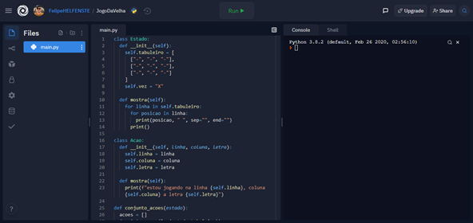
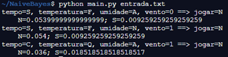

# Naive-Bayes

> Acadêmico: Felipe Helfensteler Beskow - RA: 1581201
>
> Professor: Arnaldo Candido Junior
>
> Disciplina: CC57A/C71 – Sistemas Inteligentes Aplicados

Introdução
==========

Naive-Bayes ou Bayes Ingênuo, é um classificador que se utiliza da
simplificação do Teorema de Bayes, que retorna a probabilidade de
classes dos atributos processados por ele.

Junto ao teorema, usamos a Probabilidade A Priori para calcular a
probabilidade independente de cada atributo. Com esse cálculo, foi
construído um programa em Python, que pode classificar classes binárias
com base em dados pré-estabelecidos.

Materiais utilizados
====================

Python é uma linguagem de programação desenvolvida por matemáticos e
cientistas da computação, que traz uma robustez de linguagem de baixo
nível, porém em uma linguagem de alto nível.

Para execução do projeto foi escolhido o Python, especificamente a
versão 3.8.8, por conta de sua facilidade em trabalhar com dados sem
grandes complicações.

A linguagem foi utilizada dentro de uma arquitetura em cloud do site:
Replit. Esse site dispõe de várias linguagens e framework para programar
de maneira totalmente online, como mostra a figura 1. Para acessar o
Replit foi usado o navegador Opera em sua versão 75.0.3969.93.

**Figura 1**: Exemplo de um algoritmo em Python no Replit

Probabilidade a Priori
======================

A probabilidade A Priori se baseia, única e exclusivamente, nos eventos
que já aconteceram para calcular a probabilidade de recorrência no
futuro. Para calcular a probabilidade, é necessário que a pergunta já
tenha acontecido.

Por exemplo, se houve um dia de sol sem vento, e um outro dia de chuva
com vento, a Probabilidade A Priori não poderá estimar a probabilidade
de acontecer um dia de sol com vento ou um dia de chuva sem vento.

Teorema de Bayes
================

Seguindo a premissa da probabilidade a priori, o Teorema de Bayes
utiliza de experiências passadas, se é possível verificar a
probabilidade de todas as questões, por mais que nunca tivesse ocorrido.

Através da fórmula (1), podemos calcular a probabilidade:

 (1)

Naive-Bayes
===========

O algoritmo Naive-Bayes faz uma simplificação do Teorema de Bayes para
calcular a probabilidade, conforme fórmula (2):

 (2)

Implementação
=============

O algoritmo foi implementado em Python, utilizando o Replit. O dataset
utilizado como base para a implementação está presente na tabela 1. Com
ele também foi utilizado as questões presentes na tabela 2.

**Tempo** | **Temperatura** | **Umidade** | **Vento** | **Jogar**
--------- | --------------- | ----------- | --------- | ---------
Sol | Quente | Alta | Não | Não
Sol | Quente | Alta | Sim | Não
Sol | Quente | Alta | Não | Sim
Chuva | Frio | Normal | Não | Não
Chuva | Frio | Normal | Sim | Não
Chuva | Frio | Normal | Sim | Sim
Sol | Frio | Alta | Sim | Não
Chuva | Quente | Normal | Não | Sim

**Tabela 1**: Data Set do Jogador de Tênis

**Tempo** | **Temperatura** | **Umidade** | **Vento** | **Jogar**
--------- | --------------- | ----------- | --------- | ---------
Sol | Frio | Alta | Não
Sol | Frio | Normal | Sim
Chuva | Quente | Alta | Sim

**Tabela 2**: Questão para teste do Data Set

Para cada execução o programa receberá uma entrada por meio de um
arquivo de texto, com o cabeçalho, os dados e as questões separadas por
espaços ou tabulações. O algoritmo irá separar os dados em variáveis
**cabecalho**, **dados** e **questoes**. A partir disso, irá tratar os
dados separando em matrizes e vetores.

Após feito a preparação dos dados, o programa verificará a probabilidade
de cada classe acontecer para cada questão submetida, com base nos
dados.

O cálculo utilizado é o mesmo da equação (2) supracitada. Esse cálculo
será refeito para cada linha da matriz **questao**, percorrendo a matriz
**dados**.

No fim, o algoritmo apresentará as questões com a classe mais provável
de acontecer, com a situação descrita na questão e o resultado do
cálculo para as duas classes. Conforme pode ser visto na figura 2,
utilizando os dados e as questões descritos anteriormente nas tabelas 1
e 2.

**Figura 2**: Saída do programa Naive-Bayes.

Execução, Testes e Resultados
=============================

Após a programação do classificador, aplicando ao Data Set das tabelas 1
e 2, foi possível verificar o resultado apresentado na tabela 3, em que
temos a probabilidade de Sim e Não para a questão de: se o jogador irá
jogar ou não irá jogar, conforme os atributos da questão.

**Tempo** | **Temperatura** | **Umidade** | **Vento** | **P(Não)** | **P(Sim)** | **Jogar**
--------- | --------------- | ----------- | --------- | ---------- | ---------- | -----------
Sol   | Frio   | Alta   | Não | 0.05399 | 0.00925 | Não
Sol   | Frio   | Normal | Sim | 0.054   | 0.00925 | Não
Chuva | Quente | Alta   | Sim | 0.036   | 0.01851 | Não

**Tabela 3**: Resultado do Data Set Exemplo

Podemos verificar que o jogador tem maior probabilidade não jogar nos
dias propostos pelas questões, conforme pode ser vistos na coluna Jogar
da tabela anterior.

Para testar melhor o algoritmo, foi utilizado um novo Data Set escolhido
do site *kaggle* chamado *Gender Classification*. Deste Data Set, foi
escolhido 20 linhas para ensinar o classificador e 5 linhas para testar
a eficiência, conforme apresentado nas tabelas 4 e 5, respectivamente.

**FavoriteColor** | **FavoriteMusicGenre** | **FavoriteBeverage** | **FavoriteSoftDrink** | **Gender**
----------------- | ---------------------- | -------------------- | --------------------- | ----------
Cool              | Rock                   | Vodka                | 7UP/Sprite            | F
Neutral           | Hip hop                | Vodka                | Coca Cola/Pepsi       | F
Warm              | Rock                   | Wine                 | Coca Cola/Pepsi       | F
Warm              | Folk/Traditional       | Whiskey              | Fanta                 | F
Cool              | Rock                   | Vodka                | Coca Cola/Pepsi       | F
Warm              | Jazz/Blues             | Doesn't drink        | Fanta                 | F
Cool              | Pop                    | Beer                 | Coca Cola/Pepsi       | F
Warm              | Pop                    | Whiskey              | Fanta                 | F
Warm              | Rock                   | Other                | 7UP/Sprite            | F
Neutral           | Pop                    | Wine                 | Coca Cola/Pepsi       | F
Warm              | R&B and soul           | Wine                 | Other                 | M
Neutral           | Hip hop                | Beer                 | 7UP/Sprite            | M
Warm              | Electronic             | Other                | Coca Cola/Pepsi       | M
Neutral           | Rock                   | Doesn't drink        | Coca Cola/Pepsi       | M
Cool              | Pop                    | Other                | Fanta                 | M
Cool              | Pop                    | Whiskey              | Fanta                 | M
Warm              | Rock                   | Vodka                | 7UP/Sprite            | M
Cool              | Rock                   | Vodka                | Coca Cola/Pepsi       | M
Neutral           | Pop                    | Doesn't drink        | 7UP/Sprite            | M
Warm              | R&B and soul           | Doesn't drink        | Coca Cola/Pepsi       | M

**Tabela 4**: Dataset Gender Classification

**FavColor** | **FavMusic** | **FavBeverage** | **FavSoftDrink** | **Controle**
------------ | ------------ | --------------- | ---------------- | ------------
Cool         | Pop          | Other           | 7UP/Sprite       | F
Warm         | Pop          | Wine            | 7UP/Sprite       | F
Cool         | R&B/soul     | Whiskey         | 7UP/Sprite       | M
Cool         | Rock         | No drink        | Other            | M
Warm         | Hip hop      | Beer            | Coca             | M

**Tabela 5**: Questões do Dataset Gender Classification

Após executar o algoritmo, verificou-se o resultado da tabela 6. Sendo
possível verificar que os dados nas colunas Controle e Resultado
coincidiram em 60% dos casos.

**FavColor** | **FavMusic** | **FavBeverage** | **FavSoftDrink** | **Controle** | **P(F)** | **P(M)** | **Resultado**
------------ | ------------ | --------------- | ---------------- | ------------ | -------- | -------- | -------------
Cool         | Pop          | Other           | 7UP/Sprite       | F            | 0.0009   | 0.002699 | M
Warm         | Pop          | Wine            | 7UP/Sprite       | F            | 0.003    | 0.0018   | F
Cool         | R&B/soul     | Whiskey         | 7UP/Sprite       | M            | 0        | 0.0009   | M
Cool         | Rock         | No drink        | Other            | M            | 0        | 0.00135  | M
Warm         | Hip hop      | Beer            | Coca             | M            | 0.00125  | 0.0008   | F

**Tabela 6**: Resultado Dataset Gender Classification

Os valores da primeira e última linha da tabela anterior, tiveram suas
classes resultantes não correspondidas com as classes de controle. É
possível verificar também, que a probabilidade da classe F resultou em
zero em duas linhas. Isso pode acontecer pelo fato de o cálculo da
probabilidade ser um produtório das probabilidades dos atributos com a
probabilidade da classe, logo, se algum desses elementos for zero, irá
zerar toda a equação.

Dificuldades 
=============

No progresso da execução da atividade, foi encontrado alguns problemas.
Entre eles, o fato de todo o conteúdo demandar conhecimento de
matemática probabilística, onde tive que voltar a estudar os conteúdos
de probabilidade do início da graduação. Outra dificuldade, foi o acesso
aos livros, onde pude ter acesso somente através do site Minha
Biblioteca.

Conclusões
==========

A implementação do Naive-Bayes foi muito importante pelo fato que pude
fixar os conteúdos que foram repassados pelo professor. Apesar de
entender o algoritmo em sala de aula, implementá-lo é um bom desafio que
permite “pôr a prova” os conhecimentos aprendidos.

O tema abordado tem relevância acadêmica, que se aprofundado, pode
resultar em um ensaio ou até mesmo artigo para o Meditec.

Referências
===========

MOBILE DEVELOPER AT AMDOCS. **Data Set Gender Classification**.
Disponível em:
&lt;https://www.kaggle.com/hb20007/gender-classification&gt;. Acesso em:
16 abr. 2021.

CARVALHO, André Carlos Ponce de Leon Ferreira et al. **Inteligência
Artificial - Uma Abordagem de Aprendizado de Máquina**. Grupo GEN, 2021.
Disponível em:
&lt;https://integrada.minhabiblioteca.com.br/\#/books/9788521637509/&gt;.
Acesso em: 12 abr. 2021.

CRUZ, Thaysla Fernanda Gomes Da; MEINERZ, Giovani Volnei. **Análise de
sentimentos de tweets do mercado de ações brasileiro utilizando Naive
Bayes**. Seminário de Iniciação Científica e Tecnológica da UTFPR, 2020.
Disponível em:
&lt;http://search.ebscohost.com/login.aspx?direct=true&db=ir01449a&AN=pecutf.paper.4721&lang=pt-br&site=eds-live&scope=site&gt;.
Acesso em: 16 abr. 2021.

REPLIT. Disponível em: &lt;https://replit.com&gt;. Acesso em: 6 de abr.
2021.
